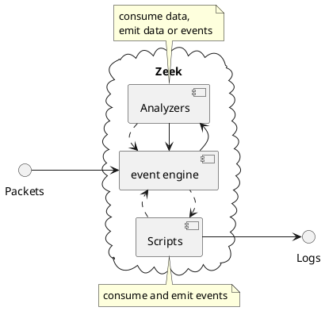

# Zeek integration

TODO(bbannier)

A diagram in UTF-8 text format (inlined automatically) foo

```plantuml,format=png
@startuml

left to right direction

() "Packets"
() "Logs"

cloud "Zeek" {

[event engine] -r-> [Analyzers]
[event engine] <-r- [Analyzers]
[event engine] <.r. [Analyzers]
Packets -d-> [event engine]

[event engine] .l.> [Scripts]
[event engine] <.l. [Scripts]
[Scripts] -d-> Logs
}

note as N1
  consume data,
  emit data or events
end note

note as N2
  consume and emit events
end note

[Analyzers] .r. N1
[Scripts] .l. N2

@enduml

```

