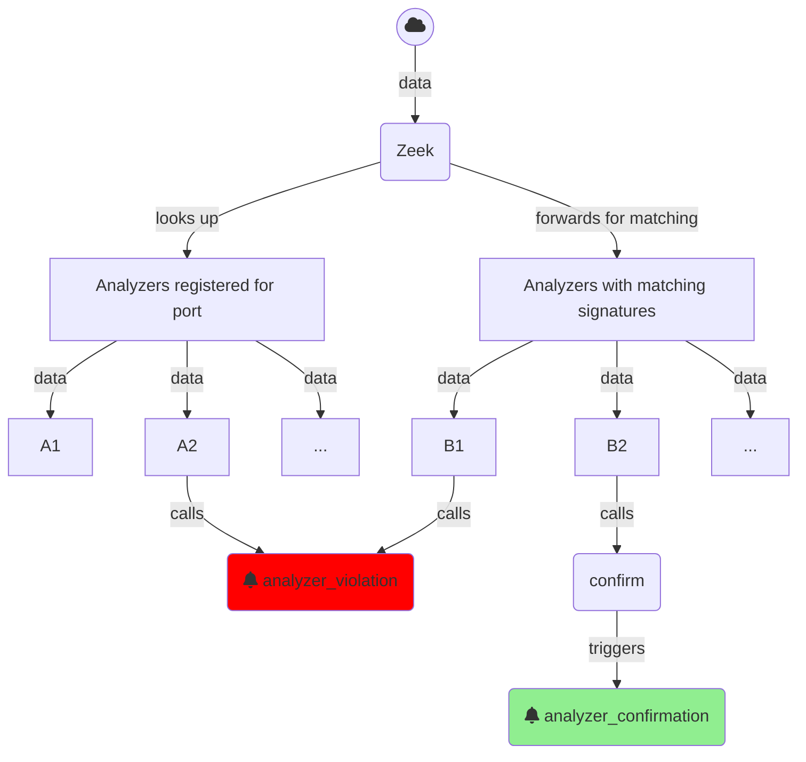

# Protocol analyzers

For a TCP protocol analyzer the template generated the following declaration in
`analyzer/*.evt`:

```plain
protocol analyzer Foo over TCP:
    parse originator with foo::Request,
    parse responder with foo::Response;
```

Here we declare a Zeek protocol analyzer `Foo` which uses to different parsers
for the originator (client) and responder (server) side of the connection,
`Request` and `Response`. To use the same parser for both sides we would declare

```plain
    parse with foo::Messages;
```

## Message and connection semantics: UDP vs. TCP

The parsers have these stub implementations:

```spicy
module foo;

public type Request = unit {
    payload: bytes &eod;
};

public type Response = unit {
    payload: bytes &eod;
};
```

We have used `&eod` to denote that we want to extract _all data_. The semantics
of _all data_ differ between TCP and UDP parsers:

- **UDP** has no connection concept so Zeek synthesizes UDP "connections" from flows by
  grouping UDP messages with the same
  [5-tuple](https://docs.zeek.org/en/master/scripts/base/init-bare.zeek.html#type-conn_id)
  in a time window. UDP has no reassembly, so a new parser instance is
  created for each UDP packet; `&eod` means _until the end of the current
  packet_.
- **TCP**: TCP supports connections and packet reassembly, so both sides of a
  connection are modelled as streams with reassembled data; `&eod` means _until
  the end of the stream_. The stream is _unbounded_.

For this reason one usually wants to model parsing of a TCP connection as a list of
protocol messages, e.g.,

```spicy
public type Requests = unit {
    : Request[];
};

type Request = unit {
    # TODO: Parse protocol message.
};
```

- length of the list of messages is unspecified so it is detected dynamically
- to avoid storing a unbounded list of messages we use an [anonymous
  field](https://docs.zeek.org/projects/spicy/en/latest/programming/parsing.html#anonymous-fields)
  for the list
- parsing of the protocol messages is responsible for detecting when a message
  ends

## Analyzer lifecycle



To integrate the parser into this the template generated the following stub implementations in `analyzer/zeek_*.spicy`:

```spicy
# TODO: Protocol analyzers should confirm once they are reasonably sure that
# they are indeed parsing the right protocol. Pick a unit that's a little bit
# into the parsing process here.
#
# on Foo::SUITABLE_UNIT::%done {
#     zeek::confirm_protocol();
# }

# Any error bubbling up to the top unit will trigger a protocol rejection.
on Foo::Request::%error {
    zeek::reject_protocol("error while parsing Foo request");
}

on Foo::Response::%error {
    zeek::reject_protocol("error while parsing Foo reply");
}
```

`TODO`
